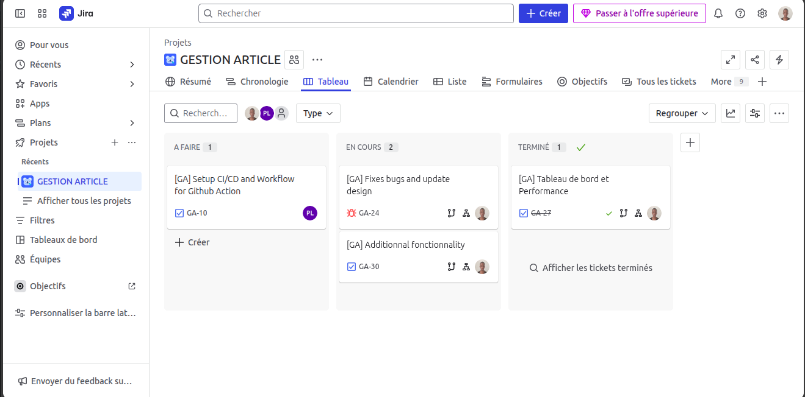

# 📚 Gestion-Article - Plateforme de Gestion et Publication d'Articles

[](https://github.com/your-repo/gestion-article)
[](https://gestion-article-frontoffice.onrender.com/)
[](LICENSE)

## 📋 Description Générale

Gestion-Article est une plateforme complète de gestion et publication d'articles développée avec NestJS. Le projet comprend un back-office pour la gestion administrative, un front-office pour la consultation publique, et une API robuste basée sur PostgreSQL.

**Statut actuel :** Projet déployé en production avec développement continu

## 🎯 Fonctionnalités Principales

### Back-Office (Interface Administrative)
- ✅ **Dashboard complet** avec statistiques et métriques
- ✅ **Gestion des articles** (CRUD complet)
- ✅ **Gestion des catégories** d'articles
- ✅ **Gestion des utilisateurs** et rôles
- ✅ **Système de commentaires** modération
- ✅ **Gestion des likes** et interactions
- ✅ **Upload de fichiers** (images de couverture, PDF)
- ✅ **Recherche avancée** avec filtres multiples
- ✅ **Système de logs** pour le suivi des activités
- ✅ **Import/Export** de données

### Front-Office (Interface Publique)
- ✅ **Consultation des articles** publiés
- ✅ **Navigation par catégories**
- ✅ **Système de recherche** avec suggestions
- ✅ **Lecture d'articles** en PDF
- ✅ **Système de commentaires** public
- ✅ **Système de likes** et interactions
- ✅ **Design responsive** moderne
- ✅ **Thème sombre/clair** configurable
- ✅ **Newsletter** et abonnements

### API Backend (NestJS)
- ✅ **API RESTful complète** avec documentation Swagger
- ✅ **Authentification JWT** sécurisée
- ✅ **Base de données PostgreSQL** avec TypeORM
- ✅ **Upload de fichiers** avec Multer
- ✅ **Validation des données** avec class-validator
- ✅ **Système de recherche** avancé
- ✅ **Gestion des médias** (images, PDF)
- ✅ **Logs système** pour le monitoring

## 🛠️ Stack Technologique

### Backend (NestJS)
- **NestJS** - Framework Node.js
- **TypeScript** - Langage de programmation
- **TypeORM** - ORM pour PostgreSQL
- **PostgreSQL** - Base de données
- **JWT** - Authentification
- **Multer** - Gestion des uploads
- **Swagger** - Documentation API

### Back-Office Frontend
- **React.js** - Framework principal
- **TypeScript** - Typage statique
- **Material-UI** - Composants UI
- **React Router** - Navigation
- **Axios** - Client HTTP
- **React Toastify** - Notifications
- **SweetAlert2** - Modales

### Front-Office Frontend
- **React.js** - Framework principal
- **TypeScript** - Typage statique
- **Tailwind CSS** - Framework CSS
- **Lucide React** - Icônes
- **React Hook Form** - Gestion des formulaires
- **Zustand** - Gestion d'état
- **Date-fns** - Manipulation des dates

### Outils & Déploiement
- **Render** - Plateforme de déploiement cloud
- **Docker** - Containerisation
- **Nginx** - Serveur web
- **Vite** - Build tool
- **ESLint** - Linting
- **Jest** - Tests unitaires
- **Git** - Versioning
- **JIRA** - Gestion de projet et suivi des tâches

## 📁 Architecture du Projet

```
Gestion-Article/
├── back-office/                 # Back-office complet
│   ├── client/                 # Interface admin React
│   │   ├── src/
│   │   │   ├── components/     # Composants admin
│   │   │   ├── views/          # Pages admin
│   │   │   ├── services/       # Services API
│   │   │   ├── context/        # Contextes React
│   │   │   └── utils/          # Utilitaires
│   │   ├── public/             # Assets statiques
│   │   └── nginx/              # Configuration Nginx
│   │
│   ├── server/                 # API NestJS
│   │   ├── src/
│   │   │   ├── articles/       # Module articles
│   │   │   │   ├── entities/   # Entités TypeORM
│   │   │   │   ├── dto/        # Data Transfer Objects
│   │   │   │   ├── controller/ # Contrôleurs
│   │   │   │   └── service/    # Services
│   │   │   ├── users/          # Module utilisateurs
│   │   │   ├── search/         # Module recherche
│   │   │   └── log/            # Module logs
│   │   ├── media/              # Fichiers uploadés
│   │   │   ├── couverture/     # Images de couverture
│   │   │   ├── livre/          # Fichiers PDF
│   │   │   └── profiles/       # Photos de profil
│   │   └── test/               # Tests
│   │
│   └── docker/                 # Configuration Docker
│       ├── local/              # Environnement local
│       └── prod/               # Environnement production
│
├── front-office/               # Front-office public
│   ├── client/                 # Interface publique React
│   │   ├── src/
│   │   │   ├── components/     # Composants publics
│   │   │   ├── pages/          # Pages publiques
│   │   │   ├── services/       # Services API
│   │   │   ├── context/        # Contextes React
│   │   │   └── utils/          # Utilitaires
│   │   ├── public/             # Assets statiques
│   │   └── nginx/              # Configuration Nginx
│   │
│   └── docker-compose.yml      # Configuration Docker
│
└── docker-compose.global.yml   # Configuration globale Docker
```

## 🗄️ Modèles de Données

### Entités Principales

#### Article
- `id` - Identifiant unique
- `titre` - Titre de l'article
- `contenu` - Fichier PDF du contenu
- `description` - Description courte
- `couverture` - Image de couverture
- `date_publication` - Date de publication
- `auteur` - Référence à l'utilisateur
- `categorie` - Référence à la catégorie
- `status` - Statut (brouillon, publié, archivé)
- `vue` - Nombre de vues
- `featured` - Article en vedette
- `reading_time` - Temps de lecture estimé

#### Catégorie
- `id` - Identifiant unique
- `nom` - Nom de la catégorie
- `description` - Description de la catégorie

#### Utilisateur
- `id` - Identifiant unique
- `nom` - Nom de l'utilisateur
- `email` - Email unique
- `password` - Mot de passe hashé
- `role` - Rôle (admin, auteur, lecteur)
- `profile_image` - Photo de profil

#### Commentaire
- `id` - Identifiant unique
- `contenu` - Contenu du commentaire
- `article` - Référence à l'article
- `utilisateur` - Référence à l'utilisateur
- `date_creation` - Date de création

#### Like
- `id` - Identifiant unique
- `article` - Référence à l'article
- `utilisateur` - Référence à l'utilisateur
- `date_creation` - Date de création

## 🔌 API Endpoints

### Routes Articles
| Méthode | Endpoint | Description |
|---------|----------|-------------|
| POST | `/articles` | Créer un article (avec upload fichiers) |
| GET | `/articles` | Récupérer tous les articles |
| GET | `/articles/article/:id` | Récupérer un article par ID |
| PATCH | `/articles/article/:id` | Modifier un article |
| DELETE | `/articles/article/:id` | Supprimer un article |
| POST | `/articles/import` | Importer plusieurs articles |

### Routes Catégories
| Méthode | Endpoint | Description |
|---------|----------|-------------|
| POST | `/articles/categories` | Créer une catégorie |
| GET | `/articles/categories` | Récupérer toutes les catégories |
| PUT | `/articles/categories/:id` | Modifier une catégorie |
| DELETE | `/articles/categories/:id` | Supprimer une catégorie |

### Routes Recherche
| Méthode | Endpoint | Description |
|---------|----------|-------------|
| GET | `/search/suggestions` | Suggestions de recherche (public) |
| GET | `/search/results` | Résultats de recherche (public) |
| GET | `/search/article` | Recherche d'articles (admin) |
| GET | `/search/categorie` | Recherche de catégories (admin) |
| GET | `/search/user` | Recherche d'utilisateurs (admin) |

## 🔐 Sécurité et Authentification

### Système d'Authentification
- **JWT (JSON Web Tokens)** pour l'authentification
- **Hachage des mots de passe** avec bcrypt
- **Guards NestJS** pour protéger les routes
- **Validation des données** avec class-validator
- **Gestion des rôles** (admin, auteur, lecteur)

### Sécurité des Fichiers
- **Validation des types de fichiers** (images, PDF)
- **Limitation de taille** des uploads
- **Noms de fichiers uniques** pour éviter les conflits
- **Séparation des dossiers** par type de média

## 🚀 Déploiement

### Plateforme de Déploiement
- **Render** - Plateforme cloud pour le déploiement des applications
- **PostgreSQL** - Base de données cloud (Render PostgreSQL)
- **GitHub** - Intégration continue avec le repository

### Configuration Cloud
- **Base de données:** PostgreSQL sur Render
- **Backend API:** Déployé sur Render (service web)
- **Frontend Public:** Déployé sur Render (site statique)
- **Back-Office:** Déployé sur Render (site statique)
- **Variables d'environnement:** Configurées dans Render

### Configuration Docker (Local)
- **Docker Compose** pour l'orchestration
- **Nginx** comme reverse proxy
- **PostgreSQL** en conteneur
- **Environnements séparés** (local/prod)
- **Volumes persistants** pour les données

### Commandes de Déploiement Local
```bash
# Déploiement global
docker-compose -f docker-compose.global.yml up -d

# Déploiement back-office
docker-compose -f back-office/docker-compose.yml up -d

# Déploiement front-office
docker-compose -f front-office/docker-compose.yml up -d
```

## 🌐 Accès en Ligne

### Applications Déployées

#### Site Web Public
- **URL:** [https://gestion-article-frontoffice.onrender.com/](https://gestion-article-frontoffice.onrender.com/)
- **Fonctionnalités:**
  - Consultation des articles publiés
  - Navigation par catégories
  - Système de recherche
  - Lecture d'articles en PDF
  - Système de commentaires
  - Interface responsive

#### Interface d'Administration
- **URL:** [https://gestion-article-backoffice-client.onrender.com/](https://gestion-article-backoffice-client.onrender.com/)
- **Identifiants de connexion:**
  - **Identifiant:** staff
  - **Email:** staff@gmail.com
  - **Mot de passe:** staff
- **Fonctionnalités:**
  - Dashboard administratif
  - Gestion des articles (CRUD)
  - Gestion des catégories
  - Gestion des utilisateurs
  - Modération des commentaires
  - Upload de fichiers (images, PDF)
  - Statistiques et analytics

## 🔄 Développement Continu

### Gestion de Projet avec JIRA



Le projet Gestion-Article utilise **JIRA** comme plateforme principale de gestion de projet pour :
- **Suivi des tâches** et user stories
- **Gestion des sprints** et planning
- **Suivi des bugs** et améliorations
- **Collaboration d'équipe** et communication
- **Reporting** et métriques de projet
- **Intégration** avec Git et outils de déploiement

### Fonctionnalités en Cours de Développement
- 🔄 **Système de notifications** en temps réel
- 🔄 **Analytics avancées** pour les articles
- 🔄 **Système de tags** pour une meilleure organisation
- 🔄 **API mobile** pour applications mobiles
- 🔄 **Système de backup** automatique
- 🔄 **Optimisation des performances** frontend et backend

### Bugs et Améliorations en Cours
- 🔧 **Correction des bugs** d'affichage responsive
- 🔧 **Optimisation** du système de recherche
- 🔧 **Amélioration** de la gestion des fichiers
- 🔧 **Correction** des problèmes d'authentification
- 🔧 **Optimisation** des requêtes base de données
- 🔧 **Amélioration** de l'expérience utilisateur

### Processus de Développement
- **Gestion de projet** avec JIRA pour le suivi des tâches et sprints
- **Déploiement continu** via Render
- **Tests automatisés** avant déploiement
- **Monitoring** des performances en production
- **Gestion des versions** avec Git
- **Backup automatique** des données

## 🧪 Tests et Qualité

- **Tests unitaires** avec Jest
- **Tests d'intégration** pour l'API
- **ESLint** pour la qualité du code
- **TypeScript** pour la sécurité des types
- **Validation des données** côté serveur

## 📊 Fonctionnalités Avancées

### Système de Recherche
- **Recherche en temps réel** avec suggestions
- **Filtres multiples** (catégorie, auteur, date)
- **Recherche dans le contenu** des articles
- **Historique de recherche** pour les utilisateurs

### Gestion des Médias
- **Upload d'images** pour les couvertures
- **Upload de PDF** pour le contenu des articles
- **Optimisation automatique** des images
- **Système de stockage** organisé

### Analytics et Logs
- **Compteur de vues** par article
- **Système de logs** pour le suivi des activités
- **Statistiques d'utilisation** dans le dashboard
- **Monitoring des performances**

## 📝 Statut de Déploiement

**Phase actuelle:** Déploiement continu en production
**Environnement de production:** Render (actif)
**Base de données:** PostgreSQL Render (opérationnelle)
**Déploiement automatique:** Intégration continue avec GitHub
**Statut:** Projet live avec développement continu

---

## 📞 Contact et Support

Pour toute question ou support concernant le projet Gestion-Article, veuillez contacter l'équipe de développement.

---

**Gestion-Article** - Documentation Technique v1.0.0  
Plateforme complète de gestion et publication d'articles avec NestJS  
*Projet déployé en production - Développement continu* 